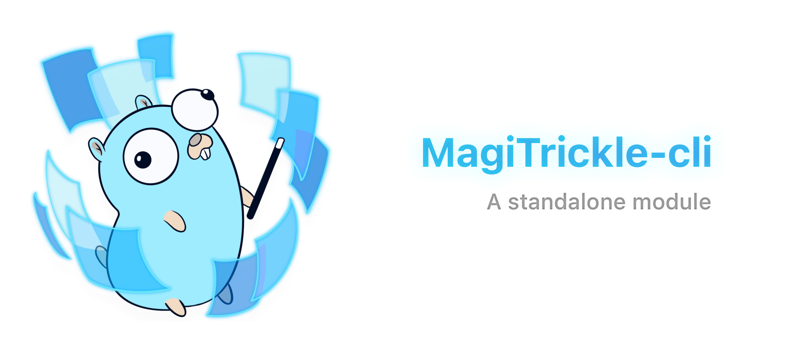

# MagiTrickle Terminal

MagiTrickle Terminal is a command-line interface (CLI) tool designed to configure and manage **MagiTrickle** directly from the terminal. It provides a streamlined way to interact with MagiTrickle without requiring a graphical interface.

***This project is still under development.***